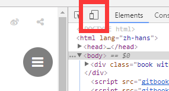
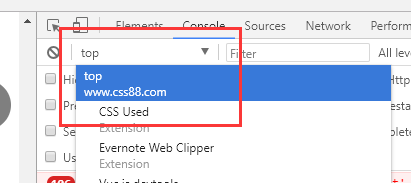
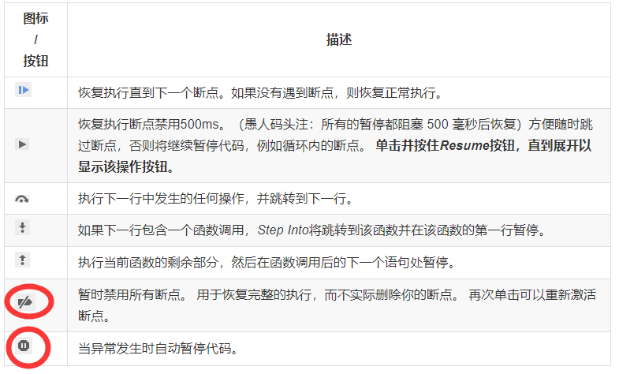
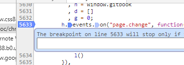
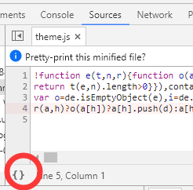
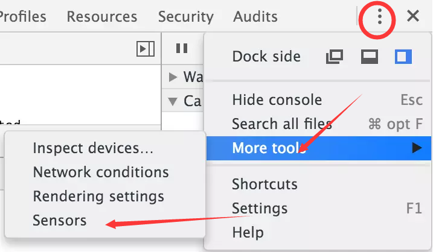

了解工具篇。

<!-- more -->

## 打开Chrome 开发者工具

- 在Chrome菜单中选择 更多工具 > 开发者工具
- 在页面元素上右键点击，选择 “检查”
- 使用快捷键 Ctrl+Shift+I (Windows) 或者 Cmd+Opt+I (Mac) 或者按 F12

## 控制面板

- 设备模式

  - 模拟网络状态
  - 设置屏幕尺寸或者响应式大小(可以选择机型，保存自定义机型等)
  - 测试响应式设计效果/旋转
  - 可以调节分辨率和DPI（设备像素比）
  - 设置User Agent

- Elements(元素)面板  
该面板中元素可以直接编辑，删除，拖拽。可以添加属性。可以主动触发状态，如（hover，focus等）  
使用scroll into view可以将dom节点移动到视图中。  
使用 breaOn 可以给dom添加断点，当对dom进行相应操作时触发断点。
  - Elements 随时检查或编辑 DOM 树中的任何元素。
  - 在Styles 查看和更改应用于选定元素的CSS规则。
  - 在Computed(计算) 查看和编辑所选元素的盒模型。
  - 在Sources(源代码) 查看您在本地网页上所做的任何更改。
    在相应的文件右键local modification可以查看做了修改的部分,并且可以**撤销修改**，或者设置**持续操作**
  - Event Listeners 查看删除dom监听的事件  
    其中Ancestors指定是否显示祖先组件监听事件，Framework listeners解决使用框架绑定事件时定位不到事件真实绑定位置的问题。取消勾选Framework listeners(框架侦听器)复选框时，事件侦听器代码可能会解析框架或库代码中的某处。

- console 控制台面板

  直接使用js代码和源程序交互。有独立面板且其它面板都包含了一个console子面板。  
  preserve log设置在页面跳转的时候保存log记录，同network。  
  右键save as保存输出记录。     
  选择执行上下文,例如想查看\<iframe\>中存在的变量，需要在(执行上下文选择器)下拉菜单中选择它。  
    

- Sources(源代码面板)
  
  - 断点调试
   
    添加断点条件（右击断点）：  
   
    所有添加的断点都可以在breakpoints子面板操作
  - 调试混淆代码
  - 使用开发者工具的Workspaces（工作区）建立持久性
  - 美化代码  
  
  - 其它断点（xhr生命周期断点/dom断点/事件监听断点/未捕获异常断点）

## 更多工具（more tools）

- sensors 可以模拟GPS和加速度

